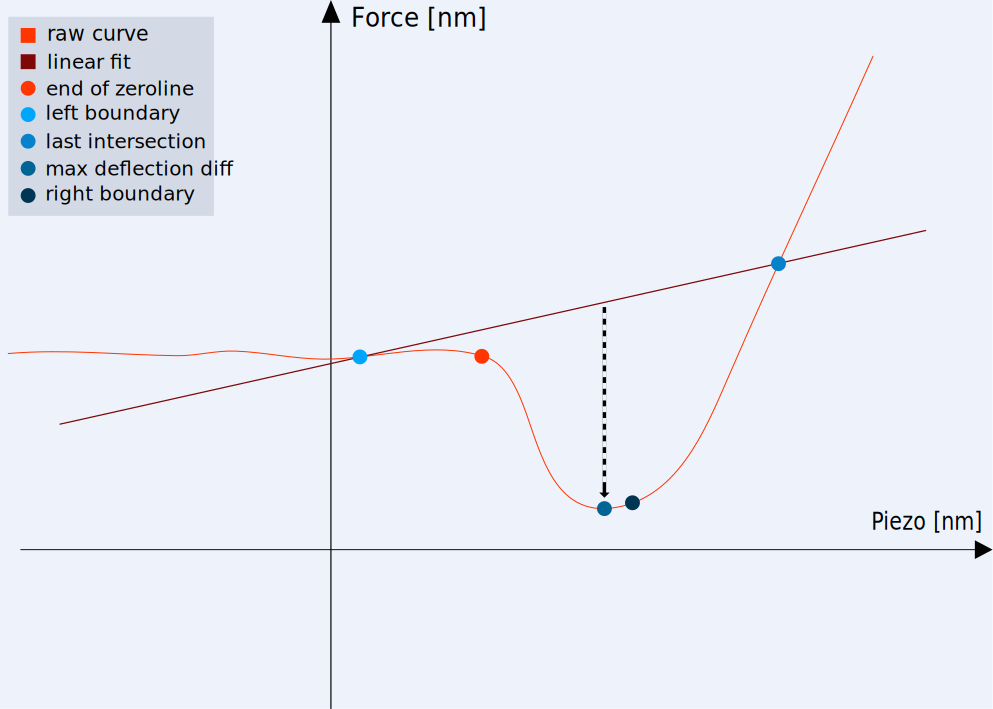

.. _correction algorithm:

====================
Correction Algorithm
====================

To be able to analyze the imported measurement data statistically, for example average a subgroup of force curves, the data needs to be corrected. Due to the experiment setup each force curve is exposed to a topography offset and a virtual deflection, shifting the curve in the x and y direction. SOFA automatically tries to shift the point of contact of each force curve to zero, correcting the errors and alignig all curves. SOFA relies on the fact that Force Curves are expected to have a certain typical shape in order to interpret the contact between probe and sample according to theories and physical models. When the quality of the force curves decreases SOFA might not be able to correct them anymore. Below some cases are listed, for which SOFA can not correct the data. 

- In case a curve shows any deviation from F = 0 for Z < 0 beyond certain noise, the point of contact can not be identified conclusively. 
- **WELCHE ANDEREN FÄLLE GIBT ES NOCH**. 

Force curves which can not be corrected are discarded by SOFA. For more detailed information about the edge cases SOFA can't currently handle, see the :ref:`Tests <tests implementation>` section. To shift the point of contact of a single force curve to zero, first its :ref:`force values <correction force>` and then the :ref:`pizeo values <correction piezo>` are corrected.

.. note::

	Up to version 1.0 SOFA processes only the approach part of every imported force distance curve.

.. _correction force:

Correction of the force
=======================

.. figure:: images/force_correction.svg
	:width: 600
	:alt: image of the correction of the force values of an approach part of a force distance curve

	Correction of the force values of an approach part of a force distance curve.

To correct the virtual deflection the force distance curve is shifted to zero along the deflection (y) axis using the end of the zeroline. Additionally the noise in the deflection values before the point of contact is smoothed. For this, the :ref:`end of the zero line <calculate end of zero line>` must first be found. With the end of the zero line a :ref:`fit of the zero line <fit zero line>` can be calculated. Using this fit the deflection values are :ref:`shifted along the deflection (y) axis <fit zero line>`. 

.. _calculate end of zero line:

Calculate the end of the zero line
----------------------------------

The end of the zero line is the last measurement point before attractive forces start to appear between the probe and sample. In other words it is the last measurement point with a positive slope before the jump to contact. To calculate the end of the zero line the :ref:`search area is first restricted <restrict search area>`. Afterwards the end of the zero line can be :ref:`located within this area <locate end of zero line>`.

.. _restrict search area:

Restrict search area
~~~~~~~~~~~~~~~~~~~~

	text.

In order to narrow down the area where the end of the zero line is located, a left and right boundary is calculated. For this a linear fit to the approach curve is calculated. The slope and interception values of this linear fit are cached and used to calculate the :ref:`raw offset and raw stiffness <raw offset stiffness>` channel. The left boundary is the first point of the approach curve where it's deflection value is smaller than that of the linear fit, similar to the first intersection point between the two curves. To determine the right boundary the second intersection point of the approach curve and it's linear fit is defined as the last point of the approach curve where it's deflection value is smaller than that of the linear fit. Subsequently the differences between the deflection values of the approach curve and the linear fit are calculated. Then the point with the maximum deflection difference within the area of the left and right intersection is determined. From this point, the right boundary is obtained by shifting the point slighty to the right. The exact amount is five percent of the difference between the right intersection and the point with the maximum deflection difference. After determining the left and right borders the end of the zero line can be located.

.. _locate end of zero line:

Locate the end of the zero line
~~~~~~~~~~~~~~~~~~~~~~~~~~~~~~~

To find the measurement point with the first negative slope before the jump to contact the approach curve must first be derived. Afterwards the first derivation is smoothed by a faussian filter with a smooth factor of 10. The first point of the smoothed first derivation of the deflection values within the left and right boundary wiht a negative slope is determined as the end of the zero line. The end of the zero line is later used to calculate the length of the attractive area which is needed to calculate the :ref:`attractive area and z attractive channel <attractive area z attractive>`. If there is no point with a negative slope in this area, the force distance curve cannot be corrected and the correction process is aborted for this curve.

.. _fit zero line:

Fit the zero line
-----------------

With the end of the zero line another linear fit of the approach curve until the end of the zero line is calculated.

.. _shift force values:

Shift the force values
----------------------

Using the linear fit of the approach curve until the end of the zero line the deflection values can be corrected. For this the deflection values of the linear fit are subtracted from the deflection values of the approach curve until the point of contact. The remaining deflection values of the approach curve are subtracted by the last deflection value of the linear fit of the end of the zero line.

.. _correction piezo:

Correction of the piezo displacement
====================================

.. figure:: images/piezo_correction.svg
	:width: 800
	:alt: image of the correction of the piezo values of an approach part of a force distance curve

	Correction of the piezo values of an approach part of a force distance curve.

To correct the topography offset the force distance curve is shifted to zero along the piezo (x) axis using the point of contact. This can only be done after the correction of the deflection values, since the point of contact is defined as the first zero crossing after the jump to contact. First the :ref:`zero crossing <calculate zero crossing>` is determined. Afterwards the exact :ref:`point of contact is calculated <interpolate point of contact>`. Finally the pizeo values of the approach curve can be :ref:`shifted using the point of contact <shift piezo values>`.

.. _calculate zero crossing:

Calculate the zero crossing
---------------------------

Locates the first zero crossing of the corrected deflection values. This point is defined as the last measurement point with a negative deflection value after the end of the zero line. If there are no points with negative deflection values after the end of the zeroline, the force distance curve cannot be corrected and the correction process is aborted for this curve.

.. _interpolate point of contact:

Interpolate point of contact
----------------------------

With the last measurement point before the zero crossing the exact piezo value at which the deflection becomes zero is calculated. 

.. _shift piezo values:

Shift the piezo values
----------------------

The piezo values of the measurement curve are subtracted by the piezo value of the point of contact shifting the point of contact to (0, 0) and completing the correction process of the force distance curve.