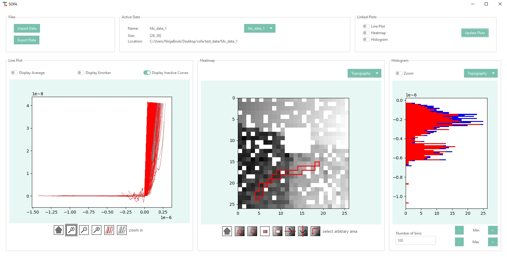

==========
Using SOFA
==========

	Main window of SOFA showing the selection process.

.. _import data:

Import Data
===========

To start working with SOFA, measurement data needs to be imported. When SOFA is started a subwindow to import data will automatically appear. This window can also be opened by clicking the :guilabel:`Import Data` button. In this subwindow the data type of the measurement data and the location of the different data files can be specified. If the :guilabel:`Show poor curves` checkbox is selected, SOFA will also plot every curve, which could not be corrected. In addition to the measurement data an optional image file, or extra channels can be imported as well. 

If SOFA can not read any of the selected files the import process is cancelled and a notification appears. Please see :ref:`import formats <import formats>` for further informations about the currently supported data types. SOFA will also check if the selected files match in size. If this is not the case, the import process is also aborted and a notification appears.

During the import process SOFA will import the data, :ref:`corrects the measurement curves <correction algorithm>`, :ref:`calculates the different channels <channels>` and plots the data in a line plot, a heatmap and a histogram. An indeterminate progress bar will run during the import process. After the data was sucessfully imported the subwindow will close it self and a notification appears. The name, size and location of the imported data will be displayed in the Active Data frame of the main window.

.. _selection process:

Selection Process
=================

After importing force spectroscopy data to SOFA, subgroups of Force Curves can be created. This is done to get averaged Force Curves with high signal-to-noise ratio for comparison and analysis. Subgroups of Force Curves are created by selecting and rejecting single curves due to their spatial position in a :ref:`parameter map <parameter maps>`, an untypical :ref:`shape <outliers>` or value ranges in the :ref:`histogram <histogram>` of a channel. These selection steps can be combined in any particular order, but we recommend to follow the order, in which these steps are presented here.

The Linked Plots frame contains a checkbox for the line plot, heatmap and histogram. If they are active, changes in their associated plot will automatically appear in every other plot as well. Automatically updating large measurement data with every change can slow down the responds time significantly. In this case it is recommended to use the :guilabel:`Update Plots` button instead. This will snychronize the changes in every plot on click.

.. _parameter maps:

Parameter maps
--------------

Parameter maps corresponding to Channels are automatically created when force spectroscopy data is imported to SOFA. These maps are displayed in the Heatmap frame of the SOFA GUI. Any additional imported channels are displayed here as well. The different channels can be selected by using the dropdown menu. In these maps the topography and spatial distribution of parameters can be used as a filter criterion for subgroups. In order to define a region of interest SOFA provides a custom :ref:`heatmap toolbar`. Deselected data appears white in the heatmap.

.. _outliers:

Outliers
--------

One of the advantages of SOFA is that all force curves are plotted in a single plot, located in the Line Plot frame of the SOFA GUI. This allows the curves to be compared directly with each other and it becomes evident that in some cases either the experimental curve is not ideal and/or SOFA’s algorithm did not succeed to correct the curve as expected. Those curves are clearly visible as outliers. These outliers might change the outcome of average curves and their standard deviation significantly, as explained in detail in :ref:`averaged subgroups of force curves`. To deselect such outliers, SOFA has a custom :ref:`lineplot toolbar`. Deselected curves appear grey in the line plot.

.. _histogram:

Histogram
---------

Every Channel can be either displayed as a map, containing the spatial information or as a histogram, containing the statistical information. The histogram is locaed in the Histogram frame of the SOFA GUI. Using the dropdown menu the different channels can be selected. The default number of bins of the histogram is 100, which can be changed by the Number of bins input field. The minimum and maximum value of the histogram can be adjusted using the :guilabel:`+` and :guilabel:`-` buttons below the histogram. To avoid distortion by extreme outliers, the zoom checkbutton can be activaed. If selected, the zoomed range equals the selected range. Within the histogram the whole data is plotted in red and the currently active data points are plotted in blue.

.. _averaged subgroups of force curves:

Averaged Subgroups of Force Curves
----------------------------------

After selecting a subgroup of curves an average curve can be calculated using the :ref:`lineplot toolbar`. The average curve is then plotted on top of the Force Curves in black. Error bars representing the standard deviation can be added by using the :ref:`lineplot toolbar`. Please note that due to the density of points, single error bars can only be made out when zooming into the plot. The average curve and its error are always recalculated and redrawn when the line plot is updated. Force Curves can be further deselected and reselected, while the average curve is already plotted. But this might slow down the responds time of SOFA.

.. note::
	
	The average curve is on purpose divided into two parts. The contact part (Z > 0 & F > 0) is averaged in respect to the force F (y- axis) and the non-contact part of the curve (Z ≤ 0) is averaged in respect to the piezo displacement Z (x-axis).

Export Data
===========

Once a subgroup has been defined and the selected curves have been averaged the analysis cycle of SOFA has been completed. Before selecting another subset of curves or analyzing another measurement the results can be exported. The :guilabel:`Export Data` button opens a subwindow to export the data. SOFA will create a new folder to store the data. A name for the folder and the path where the folder will be created, are required for this. Furthermore, the desired export formats can be specified. An indeterminate progress bar will run during the export process. After the data is saved the export winwow will close itself and a notification will appear.  

.. note::

   Up to version 1.0 SOFA has no capacities to remember previous selected subsets of Force Curves or previous averaged curves. Results have to be exported to be stored.